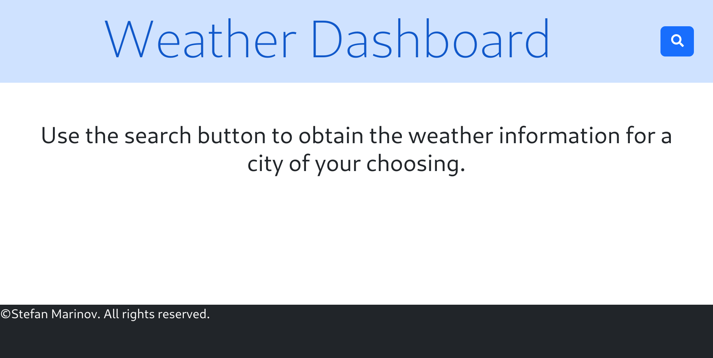
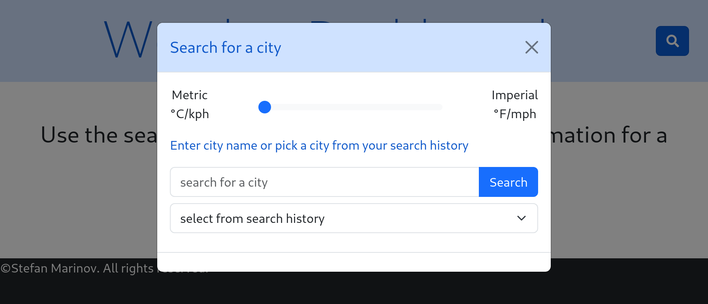
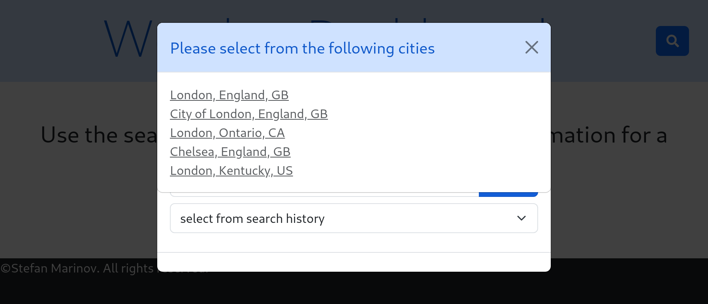
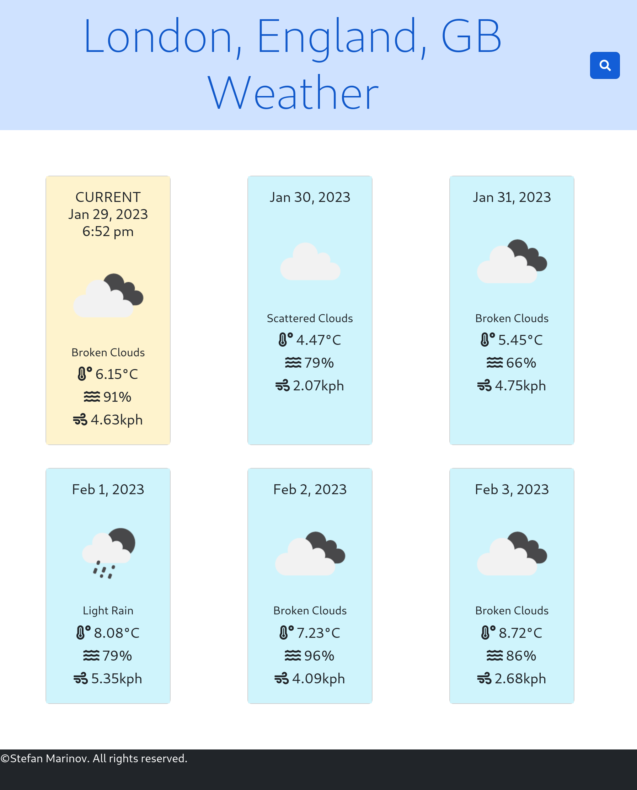

# UTOR-MOD06-CHAL01-City-Weather-Dashboard

University of Toronto - Module 06 - Challenge 01 - City - Weather - Dashboard

## Description

Repository containing the code for the Weather Application. The weather to search for the weather for particular city and receive the response in their chosen units of measurement. This application is also accounting for the fact that the city may be present in different countries; therefore, when such a city is encountered, the user is presented with up to a maximum of five possible options from which to select. The app then returns the weather for that chosen city. The user can also see a history of their previous searches and pick a city from there as well.

The weather is displayed in individual card for each day. While fetching data, placeholder cards are shown to show the user that information is arriving. When information arrives, the user is presented with temperature, humidity, and wind speed along with an image describing the weather. The user can see the current weather conditions in the first card and then the five day forecast. The current weather is also highlighted in different colour from the rest of the five day forecast.

The website is done using HTML, CSS, and JavaScript utilizing the Bootstrap, jQuery and Font Awesome (for icons).

Below is the image of the application when the user lands on the page

Below is the image of the application when the user searches for a city

Below is the image of the application when multiple cities are returned

Below is the image of the application when the weather is displayed

## Table of Contents

- [Installation](#installation)
- [Functionality](#functionality)
- [Usage](#usage)
- [Credits](#credits)
- [License](#license)

## Installation

No installation requirements. Click the URL https://scorpionfiko.github.io/UTOR-MOD06-CHAL01-City-Weather-Dashboard/ to open the webpage in your default browser.

## Functionality

The following discusses at a high level about some of the features of the website. Detailed code implementation can be found as comments in the JS files.

### Bootstrap:

The entire web site is built upon Bootstrap 5.3. All elements (header (title and search button), two modal forms, grid layout for the weather cards, and footer) are Bootstrap utilizing the Bootstrap CSS for positioning and layout. Custom colours were not used. The only custom CSS is for the creation of the footer and to capitalize the weather description as it comes in lower case from the API.

### jQuery:

The entire web site is using jQuery to build the page. The most notable locations are the city list modal box that show the list of up to five cities with same names, the placeholder weather cards, and the weather cards; these are all built dynamically after the information has been retrieved from the weather API.

### OpenWeather:

The source of the weather is OpenWeather API's. Three API's were used for that:

- Geocoding API - that provides the longitude and latitude of a city. This API also provides the listing of the additional cities with the same name that are later displayed to the user. The API restricts of up to 5 matching cities. (https://openweathermap.org/api/geocoding-api)
- Weather API - that provides the current weather conditions for the city. It uses the lattitude and longitude provided from the Geocoding API in order to provide the weather data. (https://openweathermap.org/current)
- Forecast API - that provides the 5 day forecast in 3 hour intervals. Like the weather API it uses the lattitude and longitude to provide the weather data. As the result is in 3-hour intervals, every 8th entry is used for the daily forecast. (https://openweathermap.org/forecast5)

### Local Storage:

Local storage is based on a unique city id. This is an ID that is generated by the app based on the city name, state, country, and coordinates. This ensures that cities with similar names are distinguished. The city ID is base64 encoded string based on the parameters above with all equal ("=") signs removed as jQuery does not recognize them as valid characters for an element id.

Local storage is updated when a new city is added to the list; existing cities are not overwritten.

## Usage

For accessing the weather application: 

- go to the application at: https://scorpionfiko.github.io/UTOR-MOD06-CHAL01-City-Weather-Dashboard/
- click on the search button.
- in the modal window:
  - select units of measurement
  - enter a city name or pick from the search history
- the weather is displayed on the screen

For viewing the responsiveness of the website: 
Method 1:

- Use separate computer, tablet, or phone to access the website

Method 2:

- Access the web page via web browser.
- Right click on the page and select "inspect" to open browser's developer tools
- Enable the device toolbar if not already enabled
- Use the device toolbar on the right to grow or shrink the viewable area and see how items change

## Credits

N/A

## License

Please refer to the LICENSE in the repo.

## Future Considerations

Below are some thoughts for future upgrades:

- upgrade the app to search by postal code
- combine the render functions for the placeholder cards and weather cards into one for more consisstent code
